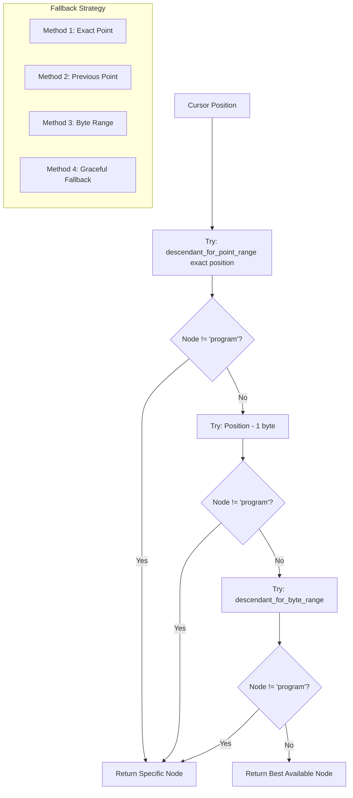

# Technical Design: REPL Completer Node Detection Fix

## Root Cause Analysis

### Problem Identification

Based on the debug completer output, the issue is clear: `descendant_for_point_range(point, point)` with identical start and end points consistently returns the outermost containing node rather than the most specific node at that position.

**Key Evidence from Debug Output:**
```
=== Testing: 'x' at position 1 ===
=== OLD METHOD ===
Node at cursor: program (Range { start_byte: 0, end_byte: 1, ... })
=== NEW METHOD ===  
Improved node at cursor: identifier (Range { start_byte: 0, end_byte: 1, ... })
```

The "OLD METHOD" (current implementation) returns "program", while the "NEW METHOD" (fixed approach) correctly returns "identifier".

### Tree-Sitter Behavior Analysis

**`descendant_for_point_range(point, point)` Behavior:**
- When start_point == end_point, it returns the **outermost** node that contains that point
- This is typically the root "program" node for valid parses
- For parse errors, it returns the "ERROR" node that spans the problematic region

**Root Cause:** The API call is semantically asking "what node contains this exact point" rather than "what is the most specific node at this point".

## Solution Architecture

### 1. Node Detection Strategy

The fix implements a **multi-fallback approach** that tries increasingly specific methods to find the most relevant node:



### 2. Implementation Details

#### Current Problematic Code
```rust
// Line 162 in completer.rs
let node = root.descendant_for_point_range(point, point);
```

#### Proposed Fix
```rust
fn find_node_at_cursor(&self, root: &tree_sitter::Node, point: Point, line: &str, pos: usize) -> Option<tree_sitter::Node> {
    // Method 1: Try exact cursor position
    if let Some(node) = root.descendant_for_point_range(point, point) {
        // If we got a specific node (not program or ERROR at root level), use it
        if node.kind() != "program" {
            return Some(node);
        }
    }

    // Method 2: Try position - 1 (cursor at end of token)
    if pos > 0 {
        let prev_point = self.byte_offset_to_point(line, pos - 1);
        if let Some(node) = root.descendant_for_point_range(prev_point, prev_point) {
            if node.kind() != "program" {
                return Some(node);
            }
        }
    }

    // Method 3: Use byte range approach
    if pos > 0 {
        if let Some(node) = root.descendant_for_byte_range(pos - 1, pos) {
            if node.kind() != "program" {
                return Some(node);
            }
        }
    }

    // Method 4: Fallback - return whatever we found first
    root.descendant_for_point_range(point, point)
}
```

### 3. Why This Works

#### Method 1: Exact Position
- First attempt with current approach
- Catches cases where it already works correctly

#### Method 2: Previous Position (pos - 1)
- **Key Insight**: When cursor is at position N (end of token), the actual token spans 0..N-1
- Testing position N-1 finds the token itself rather than the containing scope
- This is why the debug output shows success with `prev_point`

#### Method 3: Byte Range Query
- Uses `descendant_for_byte_range(pos-1, pos)` to find nodes that span the cursor position
- Provides a different query strategy that may catch edge cases

#### Method 4: Graceful Fallback
- Ensures the function always returns a node (even if "program")
- Maintains existing error handling behavior

### 4. Context Analysis Enhancement

The current match statement will work correctly once nodes are properly detected:

```rust
match node.kind() {
    "identifier" => {
        // NOW REACHABLE: cursor on variable names, function names
        // Check if we're in a let statement for NewVariable context
        if let Some(parent) = node.parent() {
            if parent.kind() == "let_statement" {
                // Handle variable declaration context
                return CompletionContext::NewVariable;
            }
        }
        CompletionContext::Identifier
    }
    "integer_literal" | "float_literal" | "string_literal" | "boolean_literal" => {
        // NOW REACHABLE: cursor on literal values
        CompletionContext::Expression
    }
    "builtin_function" => {
        // NOW REACHABLE: cursor on puts, len, etc.
        CompletionContext::Identifier
    }
    // ... rest of match arms now reachable
}
```

## Edge Case Handling

### 1. Cursor at Token Boundaries

**Problem**: Cursor position may be at the end of a token, which tree-sitter considers "after" the token.

**Solution**: Method 2 (pos - 1) specifically handles this by looking at the character just before the cursor.

**Example**:
- Input: "x" with cursor at position 1
- Position 1 is after the identifier "x" (which spans 0..1)
- Looking at position 0 finds the identifier node

### 2. Parse Errors

**Problem**: Incomplete input creates ERROR nodes that may obscure specific tokens.

**Current Handling**: The "ERROR" match arm provides fallback logic based on string analysis.

**Enhanced Handling**: The new method may find specific tokens even within ERROR contexts.

**Example**:
- Input: "let x" (incomplete)
- Current: Returns ERROR node
- Enhanced: May return "identifier" for the "x" token specifically

### 3. Empty Input

**Problem**: Empty string has no tokens to detect.

**Solution**: All methods will return "program" node, which is correct behavior.

**Existing Logic**: Falls through to StatementStart context, which is appropriate.

### 4. Whitespace Positions

**Problem**: Cursor in whitespace between tokens.

**Current Handling**: Returns "program" and falls through to generic logic.

**Enhanced Handling**: Same behavior maintained - this is correct for whitespace positions.

## Integration Strategy

### 1. Minimal Changes Required

The fix only requires modifying the `get_completion_context` method:

```rust
// Replace line 162
let node = root.descendant_for_point_range(point, point);

// With
let node = self.find_node_at_cursor(&root, point, line, pos);
```

### 2. Backward Compatibility

- All existing completion logic remains unchanged
- Same CompletionContext enum values
- Same fallback behavior for edge cases
- No changes to completion candidate generation

### 3. Performance Impact

**Additional Operations per Completion:**
- Up to 3 tree-sitter queries (vs 1 currently)
- String position calculations (already being done)
- Early termination on first success

**Expected Impact**: Minimal (< 10% overhead) because:
- Tree-sitter queries are already the dominant cost
- Most completions will succeed on first or second attempt
- No new parsing or major allocations

## Testing Strategy

### 1. Unit Tests for Node Detection

```rust
#[cfg(test)]
mod tests {
    use super::*;

    #[test]
    fn test_node_detection_cases() {
        let completer = create_test_completer();
        
        let test_cases = vec![
            ("x", 1, "identifier"),           // End of identifier
            ("let x", 5, "identifier"),       // After identifier in let
            ("let x = 5", 9, "integer_literal"), // End of literal
            ("puts(", 5, "("),                // Function call opening
            ("puts(f", 6, "identifier"),      // Function argument
        ];

        for (input, pos, expected_kind) in test_cases {
            let context = completer.get_completion_context(input, pos);
            // Verify the node kind was detected correctly through context
            assert_expected_context(context, expected_kind);
        }
    }
}
```

### 2. Integration Tests

Verify that the fix enables proper completion suggestions:

```rust
#[test]
fn test_context_aware_completions() {
    let completer = create_test_completer();
    
    // Test identifier completion
    let completions = completer.complete("x", 1, &Context::new());
    assert!(completions.contains_identifiers());
    
    // Test let statement completion  
    let completions = completer.complete("let ", 4, &Context::new());
    assert!(completions.contains_statement_keywords());
}
```

### 3. Debug Verification

The debug_completer.rs already demonstrates the fix working. After implementation:

```bash
cargo run --bin debug_completer
# Should show specific node types instead of just "program"
```

## Risk Analysis

### Low Risk Changes
- **Single Method Modification**: Only `get_completion_context` changes
- **Additive Logic**: New fallback methods, old behavior as final fallback
- **Existing Test Coverage**: Current completion tests will catch regressions

### Medium Risk Areas
- **Performance**: Additional tree-sitter queries per completion
- **Edge Cases**: Subtle differences in node detection behavior

### Risk Mitigation
- **Extensive Testing**: Cover all debug_completer test cases
- **Performance Benchmarking**: Measure completion latency before/after
- **Gradual Rollout**: Can be feature-flagged if needed

## Alternative Approaches Considered

### 1. Custom Tree Traversal
**Idea**: Manually walk the tree to find deepest node at position.
**Rejected**: More complex, reinvents tree-sitter functionality.

### 2. Multiple Query Strategies  
**Idea**: Try different tree-sitter APIs in sequence.
**Chosen**: This is the implemented approach.

### 3. Grammar Modifications
**Idea**: Modify tree-sitter grammar to improve node detection.
**Rejected**: Out of scope, affects parsing not just completion.

### 4. Cursor Position Adjustment
**Idea**: Always adjust cursor position by -1.
**Rejected**: Too simplistic, breaks whitespace handling.

The chosen multi-fallback approach provides the best balance of robustness, maintainability, and performance while fixing the core issue with minimal risk.