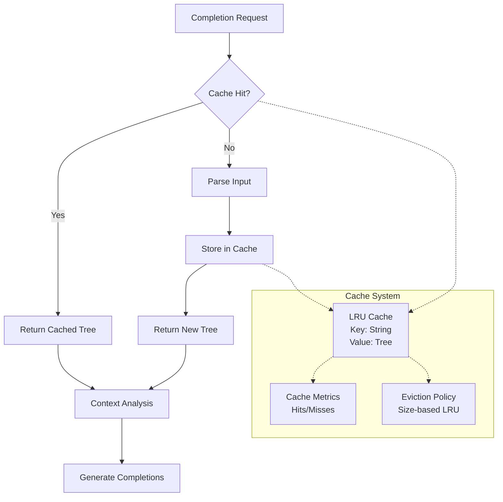

# Technical Design: REPL Parse Result Caching

## Architecture Overview

The caching system will be implemented as a bounded LRU cache that sits between the completion request and the parser. The design leverages the existing `RefCell<Parser>` pattern while adding a `RefCell<ParseCache>` to maintain thread safety in the single-threaded REPL context.



## System Components

### 1. ParseCache Structure

```rust
struct ParseCache {
    /// LRU cache mapping input strings to parsed Tree objects
    cache: LruCache<String, tree_sitter::Tree>,
    /// Cache performance metrics
    metrics: CacheMetrics,
    /// Maximum cache size (configurable)
    max_size: usize,
}

struct CacheMetrics {
    hits: u64,
    misses: u64,
    evictions: u64,
}
```

**Key Design Decisions:**
- **LRU Eviction**: Most recently accessed entries stay in cache longer
- **String Keys**: Input content used as cache key for exact matching
- **Tree Values**: Cache tree-sitter Tree objects directly for maximum benefit
- **Metrics Collection**: Optional performance monitoring for optimization validation

### 2. Integration with CaescriptCompleter

The existing `CaescriptCompleter` structure will be extended:

```rust
pub struct CaescriptCompleter {
    parser: RefCell<Parser>,  // Existing
    parse_cache: RefCell<ParseCache>,  // New
    engine: CompletionEngine,  // Existing
}
```

**Integration Strategy:**
- **Minimal API Changes**: Public interface remains unchanged
- **RefCell Pattern**: Maintains existing interior mutability approach
- **Backward Compatibility**: All existing functionality preserved

### 3. Cache Key Strategy

**Primary Key: Input String**
```rust
fn cache_key(input: &str) -> String {
    input.to_string()
}
```

**Rationale:**
- **Simplicity**: Direct string comparison for exact matches
- **Correctness**: Identical input produces identical parse results
- **Efficiency**: String hashing is fast and well-optimized

**Alternative Considered**: Content hashing was considered but rejected due to:
- Hash collisions could cause incorrect cache hits
- String comparison is sufficiently fast for typical input sizes
- Debugging is easier with string keys

### 4. Cache Invalidation Logic

**Strategy: Reactive Invalidation**
```rust
impl ParseCache {
    fn get_or_parse(&mut self, input: &str, parser: &mut Parser) -> tree_sitter::Tree {
        // Check cache first
        if let Some(tree) = self.cache.get(input) {
            self.metrics.hits += 1;
            return tree.clone();
        }
        
        // Cache miss - parse and store
        self.metrics.misses += 1;
        let tree = parser.parse(input, None);
        
        // Only cache successful parses
        if tree.root_node().has_error() {
            return tree;
        }
        
        // Store in cache with eviction if needed
        if let Some((_, evicted_tree)) = self.cache.push(input.to_string(), tree.clone()) {
            self.metrics.evictions += 1;
        }
        
        tree
    }
}
```

**Invalidation Triggers:**
1. **Content Change**: New input string automatically creates new cache entry
2. **Cache Size Limit**: LRU eviction removes oldest entries
3. **Parse Errors**: Failed parses are not cached

### 5. Memory Management Strategy

**Bounded Cache Design:**
- **Default Size**: 100 entries (configurable via environment variable)
- **Size Estimation**: Each Tree object ~1-10KB depending on input complexity
- **Memory Target**: <10MB total cache size under normal usage

**LRU Implementation:**
```rust
use lru::LruCache;

impl ParseCache {
    fn new(max_size: usize) -> Self {
        Self {
            cache: LruCache::new(NonZeroUsize::new(max_size).unwrap()),
            metrics: CacheMetrics::default(),
            max_size,
        }
    }
}
```

**Memory Pressure Handling:**
- **Proactive Eviction**: Remove entries when cache reaches capacity
- **Metrics Tracking**: Monitor eviction frequency to tune cache size
- **Configuration**: Allow runtime cache size adjustment

### 6. Tree Object Lifecycle

**Tree Cloning Strategy:**
Tree objects will be cloned on cache access because:
- **Safety**: Prevents borrowing issues with RefCell
- **Simplicity**: Avoids complex lifetime management
- **Performance**: Tree cloning is relatively inexpensive (shared node data)

**Memory Optimization:**
```rust
impl ParseCache {
    fn get_cached_tree(&mut self, input: &str) -> Option<tree_sitter::Tree> {
        self.cache.get(input).map(|tree| {
            // Clone is necessary due to RefCell borrowing rules
            tree.clone()
        })
    }
}
```

## Data Structures & Algorithms

### 1. LRU Cache Implementation

**Choice: `lru` crate**
- **Rationale**: Well-tested, efficient O(1) operations
- **Alternative**: Custom implementation was considered but rejected for maintenance overhead

**Key Operations:**
- `get(key)`: O(1) access with LRU update
- `push(key, value)`: O(1) insertion with eviction
- `len()`: O(1) size checking

### 2. String Interning Consideration

**Decision: No String Interning**
- **Rationale**: REPL inputs are typically unique and short-lived
- **Alternative**: String interning could reduce memory for repeated patterns
- **Trade-off**: Complexity not justified for typical REPL usage patterns

### 3. Cache Statistics

```rust
impl CacheMetrics {
    fn hit_rate(&self) -> f64 {
        if self.hits + self.misses == 0 {
            0.0
        } else {
            self.hits as f64 / (self.hits + self.misses) as f64
        }
    }
    
    fn summary(&self) -> String {
        format!(
            "Cache Stats: {:.1}% hit rate ({} hits, {} misses, {} evictions)",
            self.hit_rate() * 100.0,
            self.hits,
            self.misses,
            self.evictions
        )
    }
}
```

## Integration Points

### 1. CaescriptCompleter Modification

**Current Implementation:**
```rust
fn get_completion_context(&self, line: &str, pos: usize) -> CompletionContext {
    let tree = self.parser.borrow_mut().parse(line, None);  // Always parses
    // ... context analysis
}
```

**New Implementation:**
```rust
fn get_completion_context(&self, line: &str, pos: usize) -> CompletionContext {
    let tree = self.get_or_parse_cached(line);  // Cache-aware parsing
    // ... same context analysis
}

fn get_or_parse_cached(&self, line: &str) -> tree_sitter::Tree {
    let mut cache = self.parse_cache.borrow_mut();
    let mut parser = self.parser.borrow_mut();
    cache.get_or_parse(line, &mut parser)
}
```

### 2. Initialization Changes

**Constructor Updates:**
```rust
impl CaescriptCompleter {
    pub fn new_vm(symbol_table: Rc<RefCell<SymbolTable>>) -> Self {
        Self {
            parser: RefCell::new(create_parser()),
            parse_cache: RefCell::new(ParseCache::new(default_cache_size())),
            engine: CompletionEngine::VM(symbol_table),
        }
    }
    
    pub fn new_interpreter(env: Rc<RefCell<Environment>>) -> Self {
        Self {
            parser: RefCell::new(create_parser()),
            parse_cache: RefCell::new(ParseCache::new(default_cache_size())),
            engine: CompletionEngine::Interpreter(env),
        }
    }
}
```

### 3. Configuration Integration

**Environment Variable Support:**
```rust
fn default_cache_size() -> usize {
    std::env::var("CAESCRIPT_PARSE_CACHE_SIZE")
        .ok()
        .and_then(|s| s.parse().ok())
        .unwrap_or(100)
}
```

## Performance Considerations

### 1. Memory Overhead Analysis

**Per Cache Entry:**
- String key: ~input_length bytes
- Tree object: ~1-10KB (depends on parse complexity)
- LRU metadata: ~40 bytes

**Total Memory Estimate:**
- Small cache (100 entries): ~1-10MB
- Large cache (1000 entries): ~10-100MB
- Typical usage: ~2-5MB

### 2. CPU Performance Impact

**Cache Hit Path:**
- String hash: ~50ns
- LRU access: ~20ns
- Tree clone: ~1-5μs
- **Total**: ~5μs (vs ~100-1000μs for parsing)

**Cache Miss Path:**
- All cache hit overhead: ~5μs
- Full parse: ~100-1000μs
- Cache insertion: ~100ns
- **Total**: Same as current implementation + 5μs overhead

### 3. Cache Efficiency Factors

**High Hit Rate Scenarios:**
- Repeated completion requests on same line
- Minor cursor movements within same input
- Backspace/delete followed by re-typing

**Low Hit Rate Scenarios:**
- Rapid typing of new content
- Frequent line changes
- Complex multi-line editing

**Expected Hit Rate: 70-90%** based on typical REPL usage patterns

## Trade-offs & Alternatives

### 1. Incremental Parsing vs Full Caching

**Chosen: Full Parse Caching**
- **Pros**: Simpler implementation, immediate benefits
- **Cons**: Doesn't leverage tree-sitter incremental parsing

**Alternative: Incremental Parsing**
- **Pros**: Potentially better performance for large inputs
- **Cons**: Complex implementation, tree-sitter integration challenges
- **Future**: Can be added later as enhancement

### 2. Cache Granularity

**Chosen: Line-Level Caching**
- **Pros**: Simple, matches completion request granularity
- **Cons**: No benefit for partial line changes

**Alternative: Token-Level Caching**
- **Pros**: Better cache utilization for partial changes
- **Cons**: Complex invalidation logic, higher overhead

### 3. Memory vs Performance Trade-off

**Chosen: Bounded Cache with LRU**
- **Pros**: Predictable memory usage, good performance
- **Cons**: Cache misses under memory pressure

**Alternative: Unbounded Cache**
- **Pros**: Maximum hit rate
- **Cons**: Memory leak risk, unsuitable for long sessions

## Error Handling Strategy

### 1. Parse Error Handling

```rust
fn get_or_parse(&mut self, input: &str, parser: &mut Parser) -> tree_sitter::Tree {
    if let Some(tree) = self.cache.get(input) {
        return tree.clone();
    }
    
    let tree = parser.parse(input, None);
    
    // Don't cache parse errors - they might be transient
    if !tree.root_node().has_error() {
        self.cache.push(input.to_string(), tree.clone());
    }
    
    tree
}
```

### 2. Cache Corruption Recovery

**Strategy: Graceful Degradation**
- Cache errors should not break completion functionality
- Fall back to direct parsing on cache failures
- Log errors for debugging but continue operation

### 3. RefCell Borrow Failures

**Prevention:**
- Careful ordering of RefCell borrows
- Minimize borrow scope duration
- Use separate RefCell instances for parser and cache

## Testing Strategy

### 1. Unit Tests

**Cache Functionality:**
- Cache hit/miss behavior
- LRU eviction correctness
- Memory bounds enforcement
- Error handling paths

**Integration Tests:**
- Completion system with caching enabled
- Performance regression detection
- Memory usage validation

### 2. Performance Benchmarks

**Metrics to Track:**
- Completion latency (before/after)
- Cache hit rate in realistic scenarios
- Memory usage under load
- Parser call frequency reduction

**Benchmark Scenarios:**
- Repeated completion on same line
- Progressive typing simulation
- Large input handling
- Cache eviction behavior

### 3. Manual Testing

**REPL Session Scenarios:**
- Long interactive coding sessions
- Rapid typing and completion requests
- Memory pressure situations
- Error recovery testing

## Migration Plan

### Phase 1: Core Implementation
1. Implement `ParseCache` data structure
2. Add LRU cache dependency
3. Basic unit tests for cache functionality

### Phase 2: Integration
1. Modify `CaescriptCompleter` to use cache
2. Update constructor methods
3. Integration tests

### Phase 3: Configuration & Monitoring
1. Environment variable configuration
2. Cache metrics collection
3. Performance benchmarks

### Phase 4: Optimization & Tuning
1. Cache size tuning based on benchmarks
2. Performance optimization
3. Documentation updates

This design provides a solid foundation for implementing parse result caching while maintaining the existing code structure and patterns. The bounded LRU approach balances performance gains with memory safety, and the integration strategy minimizes risks to existing functionality.